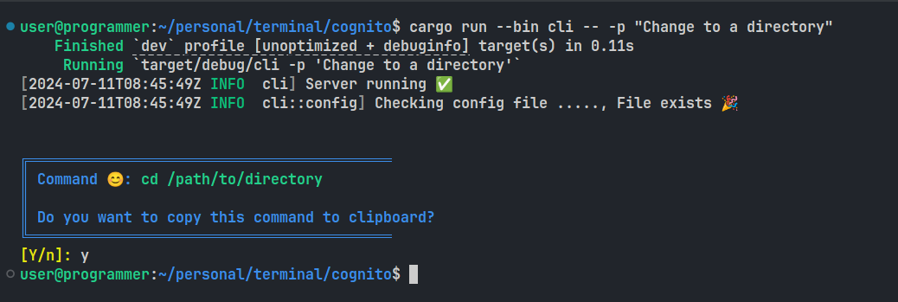

# cognito

A handy tool to create CLI commands with a touch of GPT-3 magic! 😇

## Running locally:  

#### Prerequisites  
- **Rust**: Ensure you have Rust installed on your system. You can download it from rust-lang.org.
- **OpenAI API Key**: Obtain an API key from OpenAI.

#### Steps:

- `Run the server:`
```sh
cargo run --bin server
```
- `Run the cli tool in another terminal:` 
```sh
cargo run --bin cli
```

## Usage:  

- Authorize yourself by providing your OPENAI_API key

```sh
cargo run --bin cli -- -c <OPENAI_KEY>
cargo run --bin cli -- --config <OPENAI_KEY>
```
- Get the command once authorized
```sh
cargo run --bin cli -- -p <PROMPT>
cargo run --bin cli -- --prompt <PROMPT>
```

- See the version of tool
```sh
cargo run --bin cli -- -v
cargo run --bin cli -- --version
```

- Help
```sh
cagro run --bin cli -- -h
cagro run --bin cli -- --help
```

- REPL MODE (Yet to implement)
```sh
cargo run --bin cli -- -r
cargo run --bin cli -- --repl
```

- Get the command from file_input (Yet to implement)
```sh
cargo run --bin cli -- -f <PROMPT_FILE>
cargo run --bin cli -- --prompt-file <PROMPT_FILE>
```

## Demo


## LICENSE
This project is licensed under the MIT License. See the [LICENSE](LICENSE) file for details.
